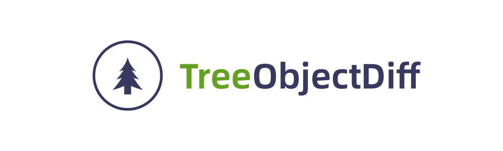

TreeObjectDiff is a small, fast and zero dependency utility for comparing and finding differences between tree-structured objects. Conventional object diff tools, as [microdiff](https://github.com/AsyncBanana/microdiff) or [deep-object-diff](https://github.com/mattphillips/deep-object-diff), typically only detect additions, deletions, and modifications. However, when dealing with tree-structured objects, it's crucial to also identify moved elements. Inspired by Vue's virtual DOM diff algorithm, this tool supports level-by-level, same-level diffing of tree-structured nodes. By utilizing node identifiers and values, it can detect not only additions, deletions, and modifications, but also movements of elements within the structure.

   

# Features

1. **Identifies Moved Elements**: Uses unique identifiers for same-level comparison
2. **Detects Changes**: Locates added, deleted, and updated values.
3. **Customizable Comparison**: Supports custom functions for complex data.
4. **Detailed Reports**: Provides comprehensive diff reports.
5. **Lightweight**: No dependencies required.
6. **TypeScript Ready**: Fully compatible with TypeScript.


# Installation

```shell
npm i --save tree-object-diff
```

# Usage

```typescript
import { diff } from "tree-object-diff";

const oldTree = [
  { id: 1, value: 1, children: [{ id: 11, value: 11 }, { id: 12, value: 12 }] },
  { id: 2, value: 2 },
  { id: 3, value: 3 },
  { id: 4, value: 4 },
];

const newTree = [
  { id: 1, value: 1, children: [{ id: 12, value: 12 }, { id: 11, value: 111 }] },
  { id: 4, value: 4 },
  { id: 3, value: 3 },
  { id: 5, value: 5 }
];

const diffDetail = diff(oldTree, newTree);
```

```json
{
  "ADD": [
    { 
      "newNode": { "id": 5, "value": 5 },
      "oldPath": [],
      "newPath": ["3"]
    }
  ],
  "DELETE": [
    { 
      "oldNode": { "id": 2, "value": 2 },
      "oldPath": ["1"],
      "newPath": []
    }
  ],
   "UPDATE": [
    {
      "oldNode": { "id": 11, "value": 11 },
      "newNode": { "id": 11, "value": 111 },
      "oldPath": ["0", "children", "0"],
      "newPath": ["0", "children", "1"]
    }
  ],
  "MOVE": [
    {
      "oldNode": { "id": 12, "value": 12 },
      "newNode": { "id": 12, "value": 12 },
      "oldPath": ["0", "children", "1"],
      "newPath": ["0", "children", "0"]
    },
    { 
      "oldNode": { "id": 4, "value": 4 },
      "newNode": { "id": 4, "value": 4 },
      "oldPath": ["3"],
      "newPath": ["1"]
    }
  ]
}
```

By default, the tree-structured data format is as follows:

```typescript
type TreeNode = {
  id: string | number;
  [key: string]: any;
  children?: TreeNodeT[];
}
type TreeDataT = TreeNodeT | TreeNodeT[];
```

Each node's identifier is `id`. To compare if a node's value has changed, we stringify the node object (excluding the `children` field) and compare the results. Fortunately, We also support custom node identification and value comparison:

- Node identification is used to detect additions, deletions, and movements.
- Node value comparison is used to detect updates.

You can customize these behaviors by providing your own comparison functions.

```typescript
import { useTreeObjectDiff } from "tree-object-diff";

const sameNodeCheck = (oldNode, newNode) => oldNode.curId === newNode.curId;
const sameNodeValue = (oldNode, newNode) => oldNode.curValue === newNode.curValue;

const { diff } = useTreeObjectDiff({ sameNodeCheck, sameNodeValue });
const diffDetail = diff(oldTree, newTree);
```

The diff result can be returned in two formats:

- As a map (default): `const diffDetail = diff(oldTree, newTree);` or  `const diffDetail = diff(oldTree, newTree, 'map');`
- As a list:  `const diffDetail = diff(oldTree, newTree, 'list');`

# Future Plans

Currently, node movement detection is limited to within the same level of the tree structure. Our future plans include: Extending the diff algorithm to support cross-level movement detection, allowing identification of all node movements regardless of their position in the tree hierarchy. This enhancement will provide even more comprehensive diff results, especially for complex tree structures where nodes might be moved across different levels.

# License

MIT
